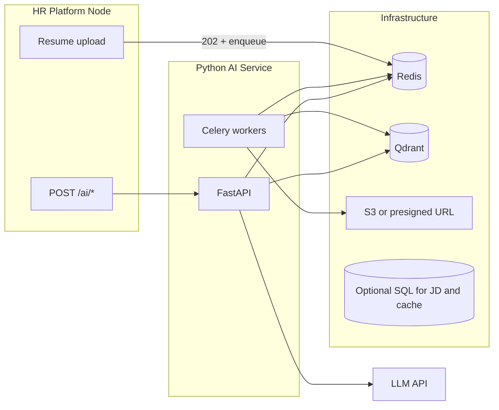

# AI Resume Intelligence — FastAPI Microservice Implementation Plan

This plan follows [AI_Resume_Intelligence_Technical.pdf](file:///Users/palash_acharya/Library/Application%20Support/Cursor/User/workspaceStorage/1ceb9f0a4548d4fe5bcdeed073b234fa/pdfs/ddcf366f-fa70-4a09-a550-672472692391/AI_Resume_Intelligence_Technical.pdf): chunked resume vectors in **Qdrant**, **bge-base-en** embeddings (local), **Celery + Redis** for ingestion, **LLM** for skill extraction (ingestion), reranking (rank), reports, and interview questions. Your existing repo ([Assignment-2](file:///Users/palash_acharya/Assignment-2)) is Node/Express; this service is a **separate process** the HR platform calls via HTTP (as in section 2.1).

---

## Architecture snapshot




---

## 1. Complete folder / file structure

Proposed new top-level directory (e.g. `ai-service/` next to your Node app, or a separate repo):

```text
ai-service/
├── pyproject.toml                 # or requirements.txt + setup.cfg
├── README.md
├── .env.example
├── Dockerfile                     # multi-stage: base deps, optional GPU variant notes
├── docker-compose.yml             # api, celery-worker, redis, qdrant, (+ optional postgres)
├── docker-compose.override.example.yaml
│
├── app/
│   ├── __init__.py
│   ├── main.py                    # FastAPI app, lifespan, router include, CORS, health
│   ├── config.py                  # pydantic-settings: Qdrant, Redis, LLM keys, model name, prefixes
│   └── dependencies.py            # shared Depends(): settings, qdrant, embedding model (lazy), http client
│
├── api/
│   ├── __init__.py
│   ├── routes/
│   │   ├── __init__.py
│   │   ├── health.py              # GET /health, GET /ready (qdrant + redis ping)
│   │   ├── rank.py                # POST /ai/rank-candidates
│   │   ├── analysis.py            # POST /ai/candidate-analysis
│   │   └── interview.py           # POST /ai/generate-interview
│   └── schemas/
│       ├── rank.py                # Pydantic request/response for ranking
│       ├── analysis.py
│       ├── interview.py
│       └── common.py              # shared fields (filters, error models)
│
├── core/
│   ├── __init__.py
│   ├── embeddings.py              # load bge-base-en once; embed_documents vs embed_query (+ prefix)
│   ├── qdrant_store.py            # collection init (cosine, HNSW m/ef_construction), upsert, search, scroll by candidate_id
│   ├── llm.py                     # provider abstraction (OpenAI / Anthropic), JSON-mode prompts, timeouts/retries
│   └── security.py                # optional internal API key / mTLS hooks for HR-only calls
│
├── pipelines/
│   ├── __init__.py
│   ├── ingestion/
│   │   ├── __init__.py
│   │   ├── parse.py               # PDF: PyMuPDF primary, pdfminer fallback; DOCX: python-docx
│   │   ├── sections.py            # header heuristics / regex for Summary, Experience, etc.
│   │   ├── chunking.py            # 300–500 tokens, 50 overlap; attach section metadata
│   │   ├── skill_extract.py       # LLM: extract skills + parent domain per experience chunk (doc section 5.2)
│   │   └── index_chunks.py        # build points: vector + payload (candidate_id, section, company, skills, years, ...)
│   ├── ranking/
│   │   ├── __init__.py
│   │   ├── query_build.py         # optional skill-graph expansion + augmented JD string (section 5.3)
│   │   ├── aggregate_scores.py    # max * 0.7 + mean(top_3) * 0.3 (configurable)
│   │   ├── filters.py             # map recruiter filters → Qdrant payload filters
│   │   └── llm_rerank.py          # top-N candidates: JD + chunks → structured scores, matched/missing skills, summary
│   ├── analysis/
│   │   └── report.py              # all chunks for candidate + JD → structured JSON report; PII redaction
│   └── interview/
│       └── generate.py            # skills profile + JD + mappings → tiered questions; seed for variety
│
├── workers/
│   ├── __init__.py
│   ├── celery_app.py              # Celery app, broker/backend URLs, task routes, queues
│   └── tasks/
│       ├── __init__.py
│       ├── resume.py              # process_resume: download → parse → sections → chunk → embed → upsert → notify/callback
│       └── maintenance.py         # optional: reindex, delete-by-candidate_id
│
├── services/
│   ├── __init__.py
│   ├── pii.py                     # Presidio (or regex) redaction before external LLM
│   ├── audit.py                   # log LLM calls: candidate_id, job_id, model, approx tokens, timestamp
│   ├── cache.py                   # optional: Redis or SQL cache for analysis/interview (doc section 6.2, 7.4)
│   └── storage.py                 # fetch resume bytes from S3 URL, presigned URL, or local path (task input)
│
├── data/
│   └── skill_graph.json           # curated base layer (section 5.2)
│
└── tests/
    ├── conftest.py
    ├── test_parse.py
    ├── test_chunk_aggregate.py
    ├── test_rank_api.py           # mocked qdrant + llm
    └── test_celery_task.py        # optional integration with testcontainers
```

**Responsibility summary**


| Area                      | Responsibility                                                                                                                |
| ------------------------- | ----------------------------------------------------------------------------------------------------------------------------- |
| `app/main.py`             | App wiring, middleware (request ID, timing), exception handlers                                                               |
| `app/config.py`           | All env-driven config; no secrets in code                                                                                     |
| `api/routes/*`            | Thin handlers: validate body, call pipeline/service, map errors to HTTP                                                       |
| `api/schemas/*`           | Contract with HR platform (align field names with Node clients)                                                               |
| `core/embeddings.py`      | **Critical:** query prefix `Represent this sentence for searching relevant passages:` for JD; documents as-is                 |
| `core/qdrant_store.py`    | Collection schema, point IDs (e.g. `{candidate_id}_{chunk_idx}`), cosine metric, HNSW tuning (`ef_construction` ~200 per doc) |
| `pipelines/ingestion/*`   | Full async pipeline stages invoked only from Celery                                                                           |
| `pipelines/ranking/*`     | Sync path for `/ai/rank-candidates`                                                                                           |
| `workers/tasks/resume.py` | End-to-end ingestion task; idempotency (delete old points for candidate before upsert)                                        |
| `services/pii.py`         | Strip/mask PII before LLM (section 10)                                                                                        |
| `services/audit.py`       | Compliance-friendly logging                                                                                                   |


---

## 2. Resume ingestion pipeline (parse → chunk → embed → index)

**Flow (matches doc section 3 + 8.1):**

1. **Trigger:** HR platform enqueues Celery task (e.g. `process_resume`) with `resume_id`, `candidate_id`, and a **file location** (S3 key, presigned URL, or internal URL the worker can GET). HTTP handler returns **202** from Node (outside this service).
2. **Download** (`services/storage.py`): Fetch bytes; validate content-type/size.
3. **Parse** (`parse.py`): PDF via **PyMuPDF**; fallback **pdfminer** for scans/odd encodings; **python-docx** for DOCX. Output: plain text. Document multi-column PDF as a known limitation (heuristics only).
4. **Section detection** (`sections.py`): Headers → Summary, Experience, Education, Projects, Skills, Certifications. Regex/light rules; optional small classifier later.
5. **Chunk** (`chunking.py`): 300–500 tokens, 50-token overlap; each chunk tagged with `section`, and optional structured fields (e.g. company) when parseable.
6. **Skill extraction** (`skill_extract.py`): Per doc, LLM on experience chunks → skills + parent domains; merge into payload and optionally feed **skill graph** dynamic layer (in-memory merge or small DB table—start in-memory + JSON persistence if needed).
7. **Embed** (`core/embeddings.py`): **bge-base-en**, 768-dim float32; batch chunks for throughput in worker.
8. **Index** (`index_chunks.py` + `qdrant_store.py`): Upsert points with payload like doc example (`candidate_id`, `section`, `company`, `skills`, `years_of_experience`, …). Use **cosine** distance. Before upserting new version: **delete** existing points for `candidate_id` to avoid stale chunks.
9. **Completion:** Callback webhook to Node or status field update—**contract with HR platform** (Node owns MariaDB/PostgreSQL truth).

**Gotchas:** Worker memory (~**400MB+ per process** for the model per doc section 11); PDF layout garbage; **idempotent** reprocessing; **PII** in Qdrant payloads—consider minimising stored PII vs operational needs.

---

## 3. Candidate ranking pipeline

**Synchronous path (doc section 4 + 8.2), target <2–3s p95:**

1. **Optional skill expansion** (`query_build.py` + `data/skill_graph.json`): Parse JD for skills, expand children/siblings, build augmented text (original dominates). Cache expansions by JD hash if needed (doc 5.4).
2. **Query embedding:** Same model with **query prefix**; single vector for full augmented JD.
3. **Qdrant search:** `top_k` 50–100 (configurable); **payload filters** (e.g. years of experience) applied in search.
4. **Aggregate** (`aggregate_scores.py`): Group hits by `candidate_id`; score = `max(scores)*0.7 + mean(top_3)*0.3` (tunable via config).
5. **LLM rerank** (`llm_rerank.py`): Take top **N** (10–20): for each candidate, pass JD + retrieved chunks (redacted); structured output: match score 0–10, matched/missing skills, short summary, role fit. **Batch or single prompt** per candidate depending on context limits and rate limits (doc 11: batching mitigation).
6. **Response:** Ordered `candidate_id` list with final scores and brief rationale for UI.

**Gotchas:** Latency dominated by **N × LLM** calls—consider parallel async with semaphore, or one multi-candidate prompt with strict JSON schema; **rate limits**; always **redact PII** before LLM.

---

## 4. The three API endpoints

### POST `/ai/rank-candidates` (`[api/routes/rank.py](file:///Users/palash_acharya/Assignment-2)`)

- **Body:** `job_description` (string), optional `filters` (years, skills, job_id for logging), optional `top_k_chunks`, `rerank_top_n`, `include_debug` (internal).
- **Behavior:** Skill expand → embed query → Qdrant → aggregate → LLM rerank top N → return ranked list + summaries.
- **Errors:** 400 validation; 502/504 LLM/Qdrant failures with safe messages.

### POST `/ai/candidate-analysis` (`[api/routes/analysis.py](file:///Users/palash_acharya/Assignment-2)`)

- **Body:** `candidate_id`, `job_id`, plus either `job_description` **or** flag to load JD from DB; optional `force_refresh`.
- **Behavior:** Check **cache** (Redis or SQL—see below); if miss: **scroll/filter Qdrant** for all points with `candidate_id`, sort by section, concatenate context, **redact**, LLM → JSON (strengths, skill_gaps, years_of_experience, recommended_role_fit, confidence_score, reasoning, interview focus per doc 6.3); store cache; return.
- **Doc note:** Architecture mentions PostgreSQL for JD and cache—**standalone options:** (A) Node passes `job_description` every time (simplest); (B) AI service has read-only DB credentials to `job_descriptions` + `analysis_cache` tables (tighter integration with [Assignment-2](file:///Users/palash_acharya/Assignment-2)).

### POST `/ai/generate-interview` (`[api/routes/interview.py](file:///Users/palash_acharya/Assignment-2)`)

- **Body:** `candidate_id`, `job_id`, optional `seed` for variety (doc 7.4), optional `force_refresh`.
- **Behavior:** Reuse or rebuild skills profile from chunks; optional reuse analysis artifact; **redact**; LLM generates tiered questions (conceptual, system design, operational, situational) with difficulty; cache keyed by `(candidate_id, job_id, seed_bucket)` or store multiple sets.

**Cross-cutting:** `services/audit.py` on every LLM use; auth header shared secret or mTLS between Node and this service (doc 10 RBAC: ultimate enforcement may stay in Node, but service should accept **allowed_candidate_ids** or signed JWT from HR platform for defense in depth).

---

## 5. Celery + Redis async processing

- `**workers/celery_app.py`:** Broker and result backend = **Redis** (same Redis instance as Node is possible but **prefer separate DB index or logical isolation** to avoid key clashes with existing [config/redis.js](file:///Users/palash_acharya/Assignment-2) usage).
- **Queues:** e.g. `ingestion` (high volume), `maintenance` (deletes).
- **Tasks:** `process_resume` as primary; retries with backoff; soft/hard time limits.
- **Worker image:** Same codebase as API; **CMD** `celery -A workers.celery_app worker -Q ingestion --concurrency=1` (concurrency: start **1 per worker** if each loads full embedding model to control RAM; scale horizontally).
- **API process:** Does **not** need to load the heavy embedding model if **all** embedding happens in workers—**but** `/ai/rank-candidates` needs embeddings for the JD on the **API** process unless you offload to a tiny sync task (adds latency). **Pragmatic split:** load **one** shared embedding model in API for **query-only** (small memory cost) or use a dedicated **lightweight embedding micro-endpoint**—simplest is **load model in both API and workers** with clear env flag `EMBEDDER_MODE=api|worker|both`.

**Gotchas:** Celery serialisation (JSON); task arguments must not embed huge blobs—pass **IDs and URLs**; monitor **queue depth** (doc section 9).

---

## 6. Docker + docker-compose (full stack)

**Services:**


| Service               | Role                                                              |
| --------------------- | ----------------------------------------------------------------- |
| `api`                 | FastAPI via uvicorn/gunicorn                                      |
| `celery-worker`       | Same image, worker command                                        |
| `redis`               | Broker + backend (+ optional cache)                               |
| `qdrant`              | Vector store; persist volume                                      |
| `postgres` (optional) | JD + analysis/interview cache if not delegating all cache to Node |


**Compose highlights:**

- Shared env: `QDRANT_URL`, `REDIS_URL`, `OPENAI_API_KEY` / `ANTHROPIC_API_KEY`, `EMBEDDING_MODEL=BAAI/bge-base-en-v1.5` (verify exact HuggingFace id for “bge-base-en”).
- **Healthchecks** for Qdrant/Redis; API `depends_on` with condition.
- **Networks:** internal network for Redis/Qdrant; expose only API port (e.g. 8000) to host or to Node network.
- **Volumes:** `qdrant_storage`, optional `huggingface` cache for faster model pull.

**Integration with existing [docker-compose.yaml](file:///Users/palash_acharya/Assignment-2):** Add `ai-service` profile or second compose file; point Node env `AI_SERVICE_URL=http://ai-service:8000`; ensure Redis DB index separation.

---

## Implementation order (recommended)

1. `**pyproject.toml` / dependencies, `app/config.py`, `.env.example`** — lock versions early.
2. `**core/qdrant_store.py` + script or pytest** — create collection (cosine, HNSW params), upsert/search smoke test.
3. `**core/embeddings.py`** — verify **768-dim** and **query prefix** with a golden test.
4. `**pipelines/ingestion/parse.py` + `chunking.py` + `sections.py`** — unit tests with fixture PDFs/DOCX.
5. `**workers/celery_app.py` + `tasks/resume.py`** — wire parse→chunk→embed→upsert; test with `docker compose run`.
6. `**api/routes/health.py` + `app/main.py`** — health/ready.
7. `**pipelines/ranking/*` + `POST /ai/rank-candidates`** — without LLM first (vector-only), then add `llm_rerank`.
8. `**data/skill_graph.json` + `query_build.py**` — plug into ranking behind feature flag.
9. `**services/pii.py` + `services/audit.py**` — enforce before any LLM path.
10. `**pipelines/analysis/report.py` + `POST /ai/candidate-analysis**` — with optional `cache.py`.
11. `**pipelines/interview/generate.py` + `POST /ai/generate-interview**` — seed + cache.
12. `**Dockerfile` + `docker-compose.yml**` — full stack; document resource limits.
13. **Integration notes for Node** — OpenAPI export, shared secret, payload contracts for Celery enqueue.

---

## External dependencies (upfront)


| Dependency                                            | Purpose                      |
| ----------------------------------------------------- | ---------------------------- |
| `fastapi`, `uvicorn[standard]`, `pydantic-settings`   | API                          |
| `celery`, `redis`                                     | Async queue                  |
| `qdrant-client`                                       | Vector DB                    |
| `sentence-transformers` + `torch`                     | bge-base-en local embeddings |
| `pymupdf` (fitz), `pdfminer.six`, `python-docx`       | Parsing                      |
| `tiktoken` or `transformers` tokenizer                | Token counts for chunking    |
| `openai` and/or `anthropic`                           | LLM                          |
| `httpx`                                               | Download resumes, webhooks   |
| `presidio-analyzer`, `presidio-anonymizer` (optional) | PII redaction                |
| `prometheus-client` or OpenTelemetry (optional)       | Metrics (doc section 9)      |


**Gotchas checklist**

- **bge-base-en** query vs document encoding (section 3.3) — wrong mode hurts recall badly.
- **Qdrant** point IDs and **delete-before-reindex** for same candidate.
- **768-dimensional** collection; don’t mix models without reindex.
- **HNSW memory** ~2MB per 1000 points (doc)—plan RAM for Qdrant.
- **LLM JSON** parsing: use provider JSON mode / schema; retries on malformed output.
- **Compliance:** PII redaction + audit logs before production LLM traffic.
- **Standalone vs integrated:** Decide early whether JD/cache live in **request bodies** only or **shared SQL** with the Node app ([Assignment-2](file:///Users/palash_acharya/Assignment-2)).

